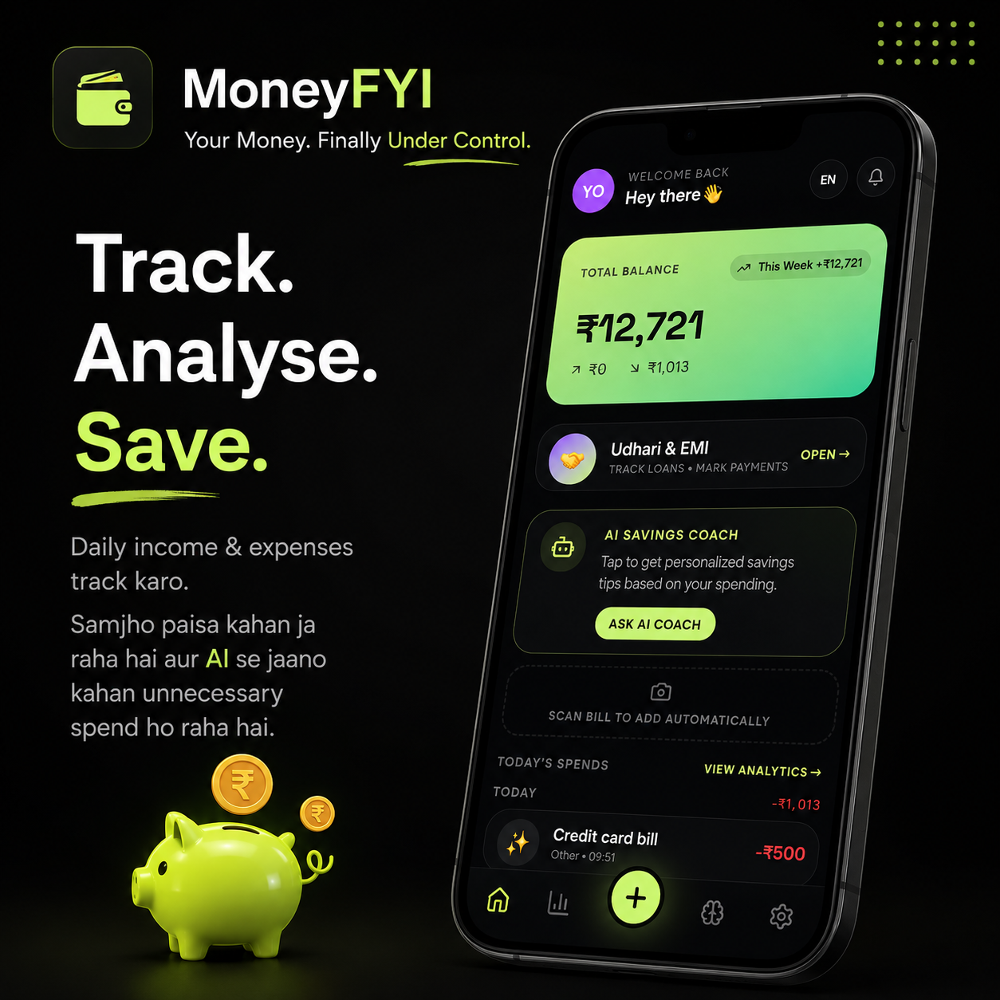

# MONEY.FYI 💸

A Gen-Z money tracker with AI savings coach, bill scanning, and voice insights — shipped as **two apps that share one backend**:

| App | Stack | Folder |
|-----|-------|--------|
| 🌐 Web / PWA | TanStack Start v1 + React 19 + Tailwind v4 | `/` (repo root) |
| 📱 Mobile (iOS + Android) | Expo SDK 51 + React Native 0.74 | `/mobile` |

> Live: **<https://moneyguruai.dev>**

---

## ✨ Features

- 📅 Daily / weekly / monthly income & expense tracking
- 📊 Analytics — bar charts + by-category breakdown
- 🤖 AI Savings Coach (Gemini via Lovable AI Gateway)
- 🔊 Voice playback — ElevenLabs (premium) + native TTS fallback
- 📸 Bill scanning — Gemini Vision auto-extracts amount + category
- 🌐 Multi-language UI — English, हिन्दी, Español, Français
- 🎨 Cyber Neon design — dark mode, lime + electric purple
- 💾 Local-first storage (localStorage on web, AsyncStorage on mobile)
- 📱 **PWA installable** on web · **real native binary** on mobile

---

## 🌐 Web App + PWA

### Run locally
```bash
bun install
bun run dev          # http://localhost:5173
bun run build        # production build
```

### Install as PWA
Open the live site (or your deployed URL) on a mobile browser → **Add to Home Screen**. The app launches in standalone mode (no browser chrome) with the MONEY.FYI icon.

Manifest: [`public/manifest.webmanifest`](public/manifest.webmanifest) · Icon: [`public/icon-512.png`](public/icon-512.png).
<p align="center">
  
</p>
<p align="center">
  
</p>
> No service worker is registered — this keeps the Lovable preview iframe stable. The app is installable and offline-ready via browser HTTP cache; for full offline support add a service worker after publishing.

### Environment variables

| Variable              | Required | Purpose |
|-----------------------|----------|---------|
| `LOVABLE_API_KEY`     | ✅ | AI advisor + bill scanning |
| `ELEVENLABS_API_KEY`  | optional | Premium AI coach voice |

Both are managed automatically inside Lovable. For local dev, put them in `.env`.
public/money1.png
---

## 📱 Mobile App (Expo React Native)

The `/mobile` folder is an **independent Expo project**. It talks to the same backend endpoints (`/api/scan-bill`, `/api/tts`, `/api/ai-advice`) hosted on the deployed web app.

### Run on your phone (Expo Go)
```bash
cd mobile
npm install
npx expo start                # scan QR code with Expo Go app
```

### Platform-specific
```bash
npx expo start --android      # Android emulator / device
npx expo start --ios          # iOS simulator (macOS)
```

### Production build (EAS) → installable APK
```bash
cd mobile
npm install -g eas-cli
eas login                                  # your own Expo account
eas build:configure
eas build -p android --profile preview     # produces a directly installable .apk
eas build -p ios                           # IPA for App Store
```
`--profile preview` (or any profile with `"android": { "buildType": "apk" }` in
`eas.json`) is what gives you a sideloadable APK; the default `production`
profile outputs an `.aab` for Play Store only. When the build finishes, EAS
prints a download link — open it on the phone, install, and allow
"install from unknown sources".

### Trial → Pro in the APK
The APK ships the same paywall as the web app:
- On first launch a **24-hour trial** starts (timestamp in AsyncStorage); a live
  countdown pill sits at the top of every screen.
- The **PRO** tab is a native pricing screen with ₹100/month and ₹999 lifetime.
  Tapping a plan opens the hosted Cashfree checkout at
  `{apiBaseUrl}/pricing?plan=…&from=apk` (UPI / card / netbanking).
- When the trial expires the app locks behind a full-screen paywall and speaks a
  Hinglish message via native TTS.
- After paying, return to the app and tap **"I've paid — activate Pro on this
  device"**, or sign in so the cloud subscription syncs.

### Cashfree webhook (one-time, in the **Production** Cashfree dashboard)
Developers → Webhooks → Add endpoint:
```
https://moneyguruai.dev/api/public/cashfree-webhook
```
Subscribe to `PAYMENT_SUCCESS_WEBHOOK` and `PAYMENT_FAILED_WEBHOOK`. The route
verifies the `x-webhook-signature` HMAC before activating a plan, then calls
`apply_paid_order`. Live keys are configured (`CASHFREE_ENV=production`), so the
Pricing page shows a **LIVE PAYMENTS** badge and every order charges real money.

### Live payment + trial→Pro verification checklist
1. Web: open `https://moneyguruai.dev/pricing` → badge must read **LIVE PAYMENTS**
   (a red banner means the keys were rejected — re-enter them).
2. Pay ₹100 with UPI. After redirect the page verifies the order and the plan flips
   to **PRO** (also visible in Settings).
3. APK: `cd mobile && eas build -p android --profile preview`, install the printed
   APK, confirm the 24h countdown pill, tap **PRO** → checkout opens on
   `moneyguruai.dev`, pay, return and tap **I've paid** (or sign in) → paywall gone.

### Point at a different backend
Edit `mobile/app.json` → `expo.extra.apiBaseUrl` (currently `https://moneyguruai.dev`).

Full mobile docs: [`mobile/README.md`](mobile/README.md).


---

## 🧱 Repo Structure

```
/
├── src/                   # web app (TanStack Start)
│   ├── routes/            # file-based routing
│   ├── components/        # SplashScreen, BottomNav, AddTransactionSheet…
│   └── lib/               # store, i18n, ai functions
├── public/
│   ├── manifest.webmanifest   # PWA manifest
│   └── icon-512.png
├── mobile/                # Expo React Native app
│   ├── App.tsx
│   ├── app.json
│   └── src/{lib,screens}
└── README.md
```

---

## 📝 License

Copyright (c) 2026 Yash Pawar. All Rights Reserved.

PROPRIETARY SOFTWARE LICENSE

This software, including its source code, documentation, designs, assets,
configuration, and related materials (“Software”), is proprietary and remains
the exclusive property of Yash Pawar.

No person or organization may use, copy, reproduce, modify, merge, publish,
distribute, sublicense, sell, rent, lease, reverse engineer, decompile,
create derivative works from, or commercially exploit any part of this
Software without prior written permission from Yash Pawar.

Permission requests must be sent to:
theyashpawar92@gmail.com

Unauthorized use, copying, modification, distribution, or resale of this
Software is strictly prohibited and may result in legal action.

THE SOFTWARE IS PROVIDED “AS IS”, WITHOUT WARRANTY OF ANY KIND, EXPRESS OR
IMPLIED, INCLUDING BUT NOT LIMITED TO WARRANTIES OF MERCHANTABILITY, FITNESS
FOR A PARTICULAR PURPOSE, AND NON-INFRINGEMENT. IN NO EVENT SHALL YASH PAWAR
BE LIABLE FOR ANY CLAIM, DAMAGES, OR OTHER LIABILITY ARISING FROM OR RELATED
TO THE SOFTWARE OR ITS USE.
